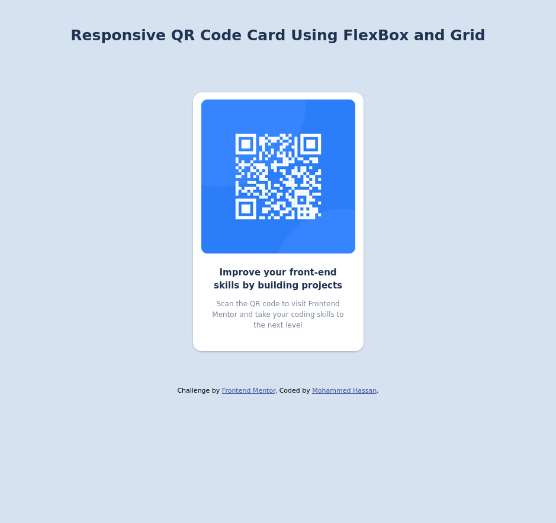

# Frontend Mentor - QR code component solution

This is a solution to the [QR code component challenge on Frontend Mentor](https://www.frontendmentor.io/challenges/qr-code-component-iux_sIO_H). Frontend Mentor challenges help you improve your coding skills by building realistic projects. 

## Table of contents

- [Frontend Mentor - QR code component solution](#frontend-mentor---qr-code-component-solution)
  - [Table of contents](#table-of-contents)
    - [Screenshot](#screenshot)
    - [Links](#links)
    - [Built with](#built-with)
    - [Useful resources](#useful-resources)
  - [Author](#author)

### Screenshot

### Links

- Solution URL: [Github](https://github.com/mohammed-b-hassan/qr-code-component)
- Live Site URL: [Github Pages](https://mohammed-b-hassan.github.io/qr-code-component/)

### Built with

- Semantic HTML5 markup
- Flexbox
- CSS Grid
- SASS CSS pre-processor.

### Useful resources

- [BEM Naming convention](https://getbem.com/) - Naming organizing css classes
.

## Author

- Frontend Mentor - [@mohammed-b-hassan](https://www.frontendmentor.io/profile/mohammed-b-hassan)

